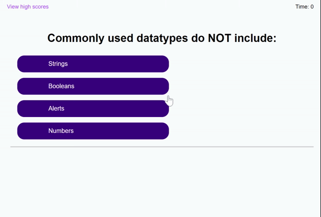

# timed_quiz

GitHub repository: https://github.com/augustinandrea/timed_quiz

GitHub live URL:  https://augustinandrea.github.io/timed_quiz/

Create a timed quiz that asks a few multiple choice questions. The timed quiz's score is the time left on the quiz. If something is answered wrong, the timed is subtracted by 10 seconds. There is a high score page that shows all the scores ranked from highest to lowest. You can also clear the high score. All scores and initials are saved to local drive.

